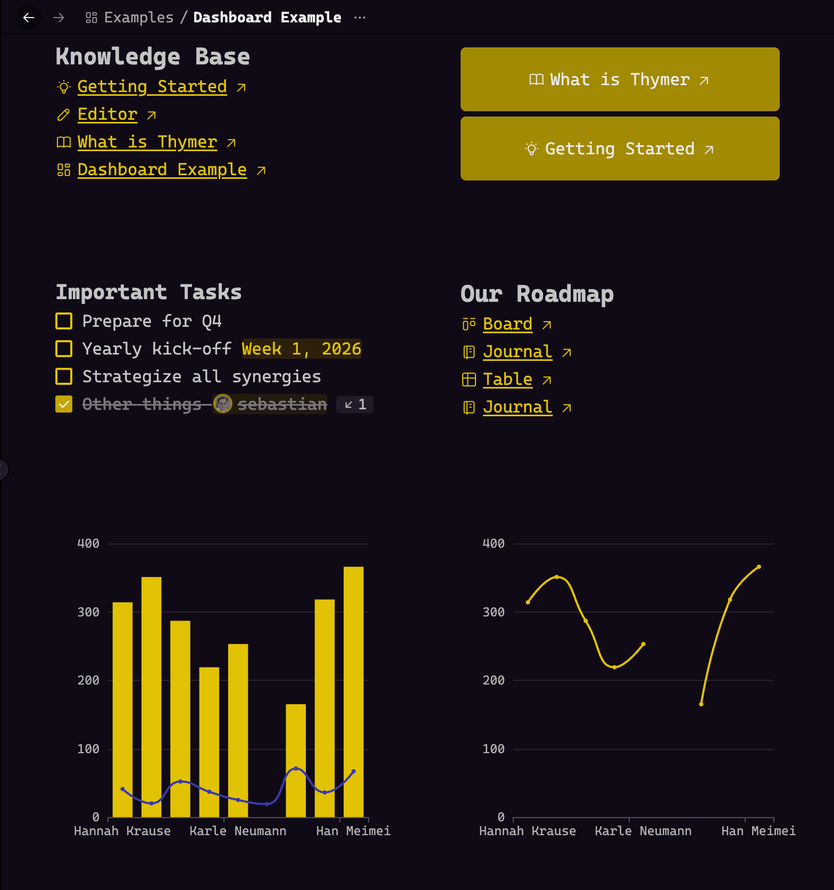

# Thymer ECharts Plugin

This plugin integrates Apache ECharts into Thymer, allowing for the creation, configuration, and rendering of charts directly within collection records and text documents.



## Functionality

The plugin extends the collection capabilities with two primary rendering modes:

1.  **Chart Editor View**: A customised collection view that provides a preview of the chart and custom previews of your data, series etc.
2.  **Inline Widgets**: A DOM observation mechanism that detects specific link references (e.g., `[[Chart Name]]`) formatted as "Link with Icons" and replaces them with an interactive ECharts web component.

# Installation

1. Download a [releases](https://github.com/Braffolk/thymer-charts/releases) zip file 
2. Go to thymer, create a collection called "Charts".
3. Select its settings and on the upper right corner, select "Edit as code".
4. Copy and paste the plugin.json file into configuration tab
5. Copy and paste the long plugin.js file into "Custom code". 
6. Save. The plugin is now enabled.

## Example

## Data Model

The plugin relies on specific properties within the collection to generate the chart configuration.

| Property | Type | Description |
| :--- | :--- | :--- |
| **title** | Text | The display name of the record. |
| **xaxis** | Choice | Axis type definition (e.g., `value`, `category`, `time`). |
| **yaxis** | Choice | Axis type definition. |
| **data** | Text | The dataset definition in JSON5 format. |
| **series** | Text | The series configuration in JSON5 format. |
| **options** | Formula | **Read-only.** Aggregates the above fields into a valid ECharts option object string. |

## Usage

### Chart Editor View

Enter your data. Currently the following formats are accepted:

*Dimensions with row-wise arrays*:
```json
{
  "dimensions": ["name", "age", "profession", "score", "date"],
  "source": [
    ["Hannah Krause", 41, "Engineer", 314, "2011-02-12"],
    ["Zhao Qian",20,"Teacher",351,"2011-03-01"],
    ...
  ]
}
```

*CSV*
```
name,age,profession,score,date
Hannah Krause,41,Engineer,314,2011-02-12
Zhao Qian,20,Teacher,351,2011-03-01
...
```

*JSON rows*
```
[
  {"name":"Hannah Krause","age":41,"profession":"Engineer","score":314,"date":"2011-02-12"},
  {"name":"Zhao Qian","age":20,"profession":"Teacher","score":351,"date":"2011-03-01"},
  ...
]
```

Pick x-axis and y-axis (currently only cartesian charts are supported). Category for categories, value for numbers and time for time.

Then click on edit series and enter your desired series types with encodings that map to dimensions:
```
[
{"type": "bar", "encode": {"x": "name", "y": "score"}},
{"type": "line", "encode": {"x": "name", "y": "age"}}
]
```

The chart will automatically render and update while you make edits.

For examples, check out [echarts examples](https://echarts.apache.org/examples/en/index.html#chart-type-line) and [documentation](https://echarts.apache.org/en/option.html).


### Inline Rendering

To render a chart within a text note:

1.  Create a link to the chart record (e.g., `[[Line Chart]]`).
2.  Set the link style to **Link with Icons** (or Link Button).
3.  The plugin's `MutationObserver` detects this element, validates the target record, and injects the `<echarts-chart>` custom element into the DOM.

## Development

This project uses the Thymer Plugin SDK and requires a local Chrome instance with remote debugging enabled.

### Prerequisites

*   Node.js
*   Google Chrome

### Installation

```bash
npm install
```

### Debugging

Start Chrome with the remote debugging port enabled:

**macOS:**
```bash
/Applications/Google\ Chrome.app/Contents/MacOS/Google\ Chrome --remote-debugging-port=9222 --user-data-dir="/tmp/chrome-debug-profile" --no-first-run https://myaccount.thymer.com
```

**Windows:**
```bash
chrome --remote-debugging-port=9222 --no-first-run https://myaccount.thymer.com
```

### Build and Watch

To start the development loop with Hot Module Replacement (HMR):

```bash
npm run dev
```

### Deployment

To generate the final bundle for manual installation:

1.  Run `npm run build`.
2.  Copy the contents of `dist/plugin.js` into the Thymer **Custom Code** dialog.
3.  Copy the contents of `plugin.json` into the Thymer **Configuration** dialog.

## Architecture

The codebase is structured into modular TypeScript components:

*   **`plugin.ts`**: Entry point. Registers properties, views, and initializes the `MutationObserver`.
*   **`echarts-chart.ts`**: A `LitElement` wrapper for the ECharts library. Handles script loading, resizing, and theme application.
*   **`echarts-data.ts` / `echarts-series.ts`**: Custom property renderers that provide preview tables and trigger the modal editor.
*   **`form-modal.ts`**: A framework-agnostic modal implementation that matches Thymer's native DOM structure and CSS variables.
*   **`helpers.ts`**: Utilities for parsing JSON5.